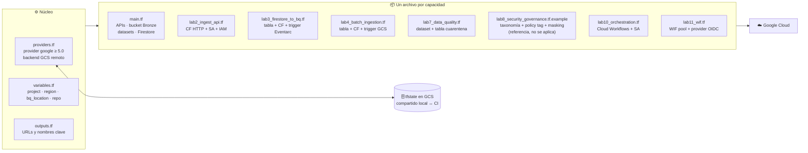
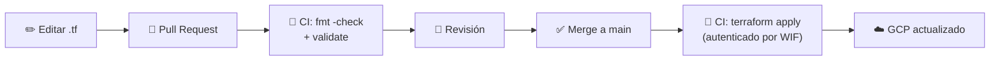
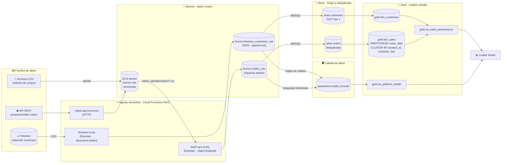
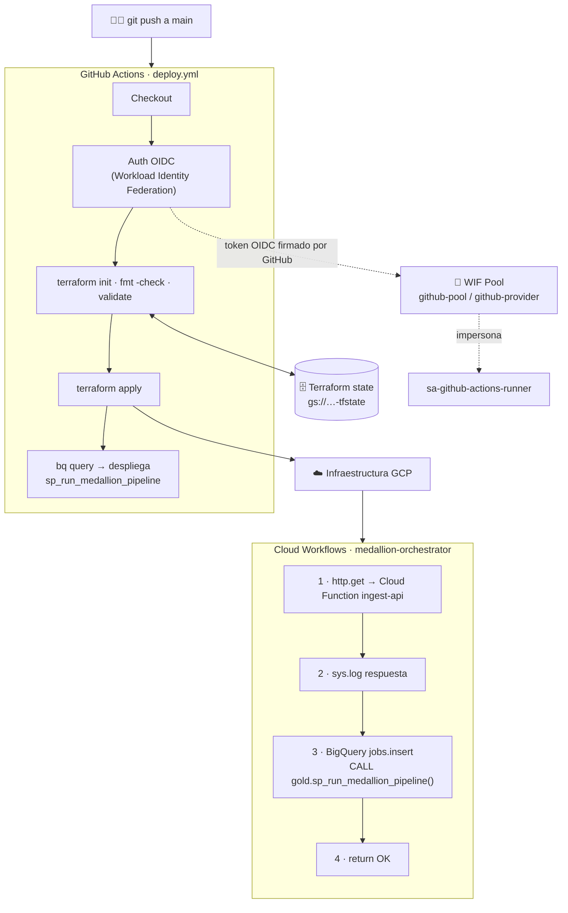
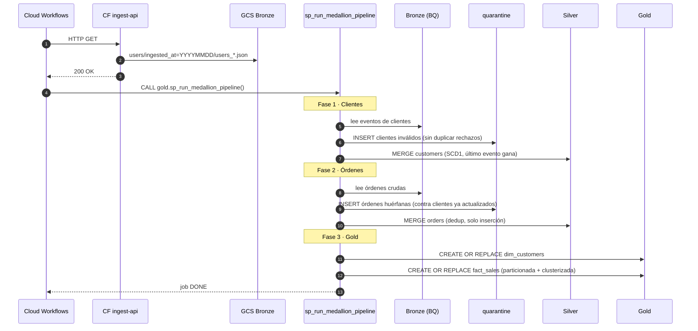
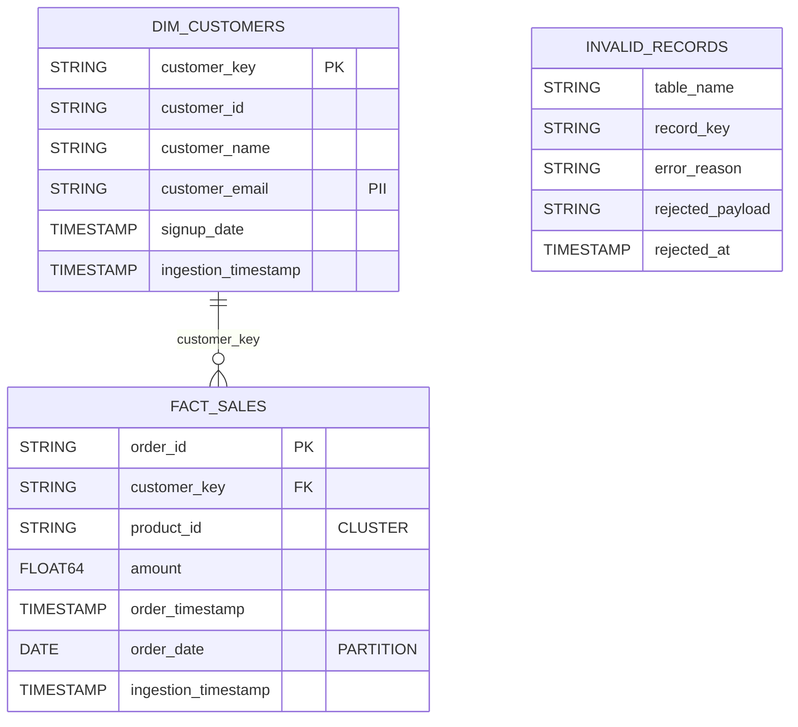

# 🏅 GCP Medallion Data Platform

**Plataforma de datos serverless end-to-end en Google Cloud con arquitectura Medallion (Bronze → Silver → Gold), 100% Infraestructura como Código, calidad de datos con cuarentena, orquestación y CI/CD sin llaves.**


---

## 📌 Tabla de contenido

- [Resumen del proyecto](#-resumen-del-proyecto)
- [Infraestructura como Código con Terraform](#-infraestructura-como-código-con-terraform)
- [Arquitectura](#-arquitectura)
- [Flujo de datos de extremo a extremo](#-flujo-de-datos-de-extremo-a-extremo)
- [Modelo de datos](#-modelo-de-datos)
- [Stack tecnológico](#-stack-tecnológico)
- [Estructura del repositorio](#-estructura-del-repositorio)
- [Laboratorios](#-laboratorios)
- [Despliegue paso a paso](#-despliegue-paso-a-paso)
- [CI/CD](#-cicd-con-github-actions--workload-identity-federation)
- [Seguridad y gobernanza](#-seguridad-y-gobernanza)
- [Decisiones de diseño](#-decisiones-de-diseño)
- [Autora](#-autora)

---

## 🎯 Resumen del proyecto

Este repositorio implementa una **plataforma de datos moderna sobre Google Cloud Platform** que ingesta tres fuentes de datos heterogéneas hacia una capa Bronze y transforma clientes y órdenes, en capas progresivas de calidad, hasta dejarlos listos para análisis de negocio en Looker Studio.

| Fuente | Tipo de ingesta | Patrón | Destino Bronze |
|---|---|---|---|
| API REST pública (`jsonplaceholder`) | Pull HTTP bajo demanda | Invocada por Cloud Workflows | `gs://<project>-bronze-raw/users/…` (data lake) |
| Firestore (colección `customers`) | Tiempo real (eventos) | **CDC** (Change Data Capture) vía Eventarc | `bronze.firestore_customers_raw` |
| Archivos CSV de órdenes | Batch reactivo | Evento `object.finalized` en GCS → BigQuery Load Job | `bronze.orders_raw` |

**Lo que demuestra este proyecto:**

- 🏗️ **Infraestructura como Código con Terraform**: 44 recursos de GCP declarados, versionados y desplegados automáticamente desde GitHub Actions.
- ⚡ **Arquitectura 100% serverless y orientada a eventos** (Cloud Functions Gen2 + Eventarc).
- 🔄 **Procesamiento incremental** con `MERGE`, deduplicación con `ROW_NUMBER()` y **SCD Tipo 1**.
- 🛡️ **Calidad de datos** con reglas de validación y **patrón de cuarentena** auditable.
- 🔐 **Seguridad y gobernanza**: una cuenta de servicio dedicada por componente y diseño en Terraform de enmascaramiento dinámico de PII con Policy Tags.
- ⭐ **Modelado dimensional** (esquema en estrella) con tablas **particionadas y clusterizadas**.
- 🎼 **Orquestación** serverless con Cloud Workflows y un Stored Procedure de BigQuery.
- 🚀 **CI/CD sin llaves** con GitHub Actions + **Workload Identity Federation (OIDC)**.
- 📊 **Capa de consumo** con vistas semánticas para Looker Studio (ventas y salud de la plataforma).

---

## 🧱 Infraestructura como Código con Terraform

> **Toda la infraestructura de la plataforma se crea, modifica y destruye con Terraform.** Cada API, bucket, dataset, tabla Bronze, función, permiso IAM, trigger de Eventarc, el orquestador y la federación de identidades con GitHub están declarados en código. La lógica de datos (tablas Silver/Gold, Stored Procedure y vistas) se versiona como SQL en [`sql/`](sql/) y el Stored Procedure se despliega desde el pipeline de CI/CD.

<table>
<tr>
<td align="center"><h2>44</h2>recursos GCP gestionados</td>
<td align="center"><h2>10</h2>APIs habilitadas por código</td>
<td align="center"><h2>5</h2>cuentas de servicio dedicadas</td>
<td align="center"><h2>18</h2>bindings IAM declarativos</td>
<td align="center"><h2>0</h2>llaves JSON de servicio</td>
</tr>
</table>

### ¿Por qué esto importa?

| Sin IaC (consola manual) | Con Terraform (este proyecto) |
|---|---|
| Pasos manuales difíciles de repetir | `terraform apply` recrea todo el entorno en minutos |
| Nadie sabe quién cambió qué permiso | Cada cambio queda en el historial de Git y se revisa en un Pull Request |
| Entornos dev / prod que divergen | Mismo código, distintas variables (`terraform.tfvars`) |
| Permisos amplios "para que funcione" | IAM explícito y auditable por componente |
| Riesgo al borrar recursos olvidados | `terraform destroy` limpia exactamente lo que se creó |

### Cómo está organizado el código



### Técnicas de Terraform aplicadas

| Técnica | Dónde | Qué aporta |
|---|---|---|
| **Backend remoto en GCS** | `providers.tf` | Estado compartido y seguro entre la máquina local y GitHub Actions |
| **`for_each` sobre un `toset()`** | `main.tf` | Habilita todas las APIs con un único bloque |
| **`data "archive_file"`** | `lab2/3/4_*.tf` | Empaqueta el código Python de cada función directamente desde `src/` |
| **Hash MD5 en el nombre del artefacto** | `google_storage_bucket_object` | Una función solo se redespliega si su código cambió |
| **`templatefile()`** | `lab10_orchestration.tf` | Inyecta la URL real de la función y el project ID en el YAML del workflow |
| **Referencias entre recursos** | Todos | Terraform infiere el orden de creación (grafo de dependencias) |
| **`depends_on` explícito** | Funciones y workflow | Garantiza que los permisos IAM existan antes de desplegar |
| **Variables de entorno desde recursos** | `service_config.environment_variables` | Las funciones reciben nombres de bucket/tabla sin hardcodear |
| **Esquemas de BigQuery como código** | Tablas Bronze y cuarentena | El contrato de datos se versiona junto con la infraestructura |
| **Data sources** | `google_project`, `google_storage_project_service_account` | Obtiene el número de proyecto y el agente de GCS de forma dinámica |
| **Outputs para CI/CD** | `lab11_wif.tf` | Entrega los valores exactos para los secrets de GitHub |
| **Quality gate `fmt -check` + `validate`** | `deploy.yml` | Ningún cambio mal formateado o inválido se despliega en GCP |

### Ciclo de vida de un cambio de infraestructura



---

## 🌐 Arquitectura

### Vista general



> 📐 **Diagrama editable en DrawIO:** [`docs/diagrams/arquitectura-medallion.drawio`](docs/diagrams/arquitectura-medallion.drawio) — ábrelo en [app.diagrams.net](https://app.diagrams.net) o con la extensión *Draw.io Integration* de VS Code.

### Capa de orquestación y despliegue



### Cuentas de servicio dedicadas

Cada componente se ejecuta con **su propia identidad** y roles acotados a su función:

| Service Account | Componente | Roles principales |
|---|---|---|
| `sa-ingest-api` | CF `ingest-api-to-bronze` | `storage.objectUser` **solo** sobre el bucket Bronze |
| `sa-firestore-to-bq` | CF `firestore-to-bq` | `bigquery.dataEditor`, `bigquery.user`, `eventarc.eventReceiver` |
| `sa-batch-ingest` | CF `batch-gcs-to-bq` | `storage.objectViewer` (bucket Bronze), `bigquery.dataEditor`, `bigquery.user`, `eventarc.eventReceiver` |
| `sa-medallion-orchestrator` | Cloud Workflows | `bigquery.jobUser`, `bigquery.dataEditor`, `logging.logWriter`, `run.invoker` (solo la CF de API) |
| `sa-github-actions-runner` | GitHub Actions | `editor` + `iam.workloadIdentityUser` restringido al repositorio |

> ℹ️ En este entorno de laboratorio las tres Cloud Functions permiten invocación pública (`allUsers`) para facilitar las pruebas manuales.

---

## 🔄 Flujo de datos de extremo a extremo



---

## 🧩 Modelo de datos

### Capa Gold – esquema en estrella



### Datasets y tablas

| Capa | Objeto | Descripción |
|---|---|---|
| 🥉 Bronze | `bronze.firestore_customers_raw` | Eventos CDC de Firestore. Payload guardado como **JSON** (schema-on-read). Append-only. |
| 🥉 Bronze | `bronze.orders_raw` | Órdenes desde CSV. Esquema estricto definido en Terraform (`autodetect=False`). |
| 🥉 Bronze | `gs://<project>-bronze-raw` | Data lake de archivos crudos, versionado. Particionado lógico `ingested_at=YYYYMMDD`. |
| 🛡️ Quarantine | `quarantine.invalid_records` | Tabla unificada de rechazos con motivo y payload original. |
| 🥈 Silver | `silver.customers` | Clientes tipados, normalizados (trim/lower), una fila por cliente (SCD1). |
| 🥈 Silver | `silver.orders` | Órdenes tipadas, deduplicadas, con integridad referencial y `amount > 0`. |
| 🥇 Gold | `gold.dim_customers` | Dimensión de clientes **activos**. |
| 🥇 Gold | `gold.fact_sales` | Hechos de ventas particionados por día y clusterizados. |
| 🥇 Gold | `gold.vw_sales_performance` | Vista semántica hechos + dimensión para BI. |
| 🥇 Gold | `gold.vw_platform_health` | Vista de observabilidad: errores de calidad por tabla y motivo. |
| 🥇 Gold | `gold.sp_run_medallion_pipeline` | Stored Procedure que ejecuta todo el pipeline Bronze → Gold. |

### Reglas de calidad implementadas

| Entidad | Regla | Acción |
|---|---|---|
| Cliente | `name` nulo o vacío | ➜ Cuarentena |
| Cliente | `email` no cumple `%@%.%` | ➜ Cuarentena |
| Cliente | `signup_date` en el futuro | ➜ Cuarentena |
| Orden | `customer_id` inexistente en `silver.customers` | ➜ Cuarentena (integridad referencial) |
| Orden | `amount <= 0` | ➜ Excluida de Silver |
| Orden | `id` duplicado (archivo cargado dos veces) | ➜ Deduplicada con `ROW_NUMBER()` |

---

## 🧰 Stack tecnológico

| Categoría | Tecnología | Uso en el proyecto |
|---|---|---|
| Cloud | **Google Cloud Platform** | Proveedor de toda la plataforma |
| IaC | **Terraform** (`hashicorp/google >= 5.0`) | Aprovisionamiento completo, backend remoto en GCS |
| Cómputo | **Cloud Functions Gen2** (Python 3.11, sobre Cloud Run) | Ingesta API, CDC y batch |
| Eventos | **Eventarc** | Triggers de Firestore y Cloud Storage |
| Almacenamiento | **Cloud Storage** | Data lake Bronze + artefactos de funciones + estado de Terraform |
| NoSQL | **Firestore (modo nativo)** | Fuente operacional de clientes |
| Data Warehouse | **BigQuery** | Bronze / Silver / Gold / Quarantine, SQL, Stored Procedures |
| Orquestación | **Cloud Workflows** | Pipeline end-to-end con conector nativo de BigQuery |
| Gobernanza | **Data Catalog + BigQuery Data Policies** | Policy Tags y enmascaramiento dinámico de email (Lab 08, implementación de referencia) |
| CI/CD | **GitHub Actions** + **Workload Identity Federation** | Validación y despliegue sin llaves JSON |
| BI | **Looker Studio** | Dashboards de ventas y salud de la plataforma sobre vistas de Gold |

---

## 📁 Estructura del repositorio

```text
gcp-medallion/
├── .github/workflows/
│   └── deploy.yml                    # Pipeline CI/CD (Terraform + Stored Procedure)
├── docs/
│   ├── diagrams/
│   │   └── arquitectura-medallion.drawio   # Diagrama editable
│   └── labs/                         # 📚 Un README por laboratorio
├── src/                              # Código de las Cloud Functions (Python 3.11)
│   ├── ingest_api/                   # Lab 02 · API REST → GCS
│   ├── firestore_trigger/            # Lab 03 · Firestore CDC → BigQuery
│   └── ingest_batch/                 # Lab 04 · CSV en GCS → BigQuery
├── sql/                              # Transformaciones BigQuery
│   ├── silver_*.sql                  # Labs 05-06 · Bronze → Silver (full load + MERGE)
│   ├── quality_*_audit.sql           # Lab 07 · Auditorías → cuarentena
│   ├── gold_dim_customers.sql        # Lab 09 · Dimensión
│   ├── gold_fact_sales.sql           # Lab 09 · Hechos particionados/clusterizados
│   ├── gold_sp_run_medallion_pipeline.sql  # Lab 10 · Stored Procedure orquestado
│   └── gold_vw_*.sql                 # Lab 12 · Vistas para Looker Studio
├── terraform/
│   ├── providers.tf                  # Provider + backend remoto GCS
│   ├── variables.tf / outputs.tf
│   ├── main.tf                       # Lab 01 · APIs, bucket, datasets, Firestore
│   ├── lab2_ingest_api.tf
│   ├── lab3_firestore_to_bq.tf
│   ├── lab4_batch_ingestion.tf
│   ├── lab7_data_quality.tf
│   ├── lab8_security_governance.tf.example
│   ├── lab10_orchestration.tf
│   ├── lab11_wif.tf
│   └── terraform.tfvars.example
├── workflows/
│   └── medallion_workflow.yaml       # Definición de Cloud Workflows (templatefile)
├── orders.csv / orders_erroneas.csv  # Datos de ejemplo (válidos / inválidos)
└── scripts/                          # Comandos de prueba de cada laboratorio (ejecutar desde la raíz)
    └── labNN_commands.sh
```

---

## 📚 Laboratorios

El proyecto se construyó de forma incremental en **12 laboratorios**. Cada uno tiene su propio README con objetivos, arquitectura, código explicado y pasos de validación.

| # | Laboratorio | Conceptos clave | Documentación |
|:-:|---|---|:-:|
| 01 | Fundamentos e Infraestructura como Código | Terraform, APIs, datasets Medallion, Firestore | [📖](docs/labs/lab01-fundamentos-terraform/README.md) |
| 02 | Ingesta desde API REST a Bronze | Cloud Functions Gen2 HTTP, GCS, SA dedicada | [📖](docs/labs/lab02-ingesta-api/README.md) |
| 03 | CDC en tiempo real Firestore → BigQuery | Eventarc, Protobuf, streaming insert, JSON | [📖](docs/labs/lab03-cdc-firestore-bigquery/README.md) |
| 04 | Ingesta batch reactiva GCS → BigQuery | Evento `object.finalized`, BigQuery Load Job | [📖](docs/labs/lab04-ingesta-batch/README.md) |
| 05 | Transformación Bronze → Silver | JSON_VALUE, tipado, normalización | [📖](docs/labs/lab05-bronze-a-silver/README.md) |
| 06 | Carga incremental SCD Tipo 1 y deduplicación | `MERGE`, `ROW_NUMBER()`, idempotencia | [📖](docs/labs/lab06-scd1-deduplicacion/README.md) |
| 07 | Calidad de datos y cuarentena | Reglas de validación, integridad referencial | [📖](docs/labs/lab07-calidad-cuarentena/README.md) |
| 08 | Seguridad y gobernanza | Policy Tags, Data Masking, PII | [📖](docs/labs/lab08-seguridad-gobernanza/README.md) |
| 09 | Modelado dimensional en Gold | Esquema estrella, particionamiento, clustering | [📖](docs/labs/lab09-modelado-dimensional/README.md) |
| 10 | Orquestación con Cloud Workflows | Stored Procedure, conectores nativos | [📖](docs/labs/lab10-orquestacion-workflows/README.md) |
| 11 | CI/CD con GitHub Actions y WIF | OIDC, estado remoto, despliegue automatizado | [📖](docs/labs/lab11-cicd-github-actions/README.md) |
| 12 | Visualización con Looker Studio | Vistas semánticas, observabilidad | [📖](docs/labs/lab12-looker-studio/README.md) |

---

## 🚀 Despliegue paso a paso

### Prerrequisitos

- Proyecto de GCP con facturación habilitada.
- [Google Cloud SDK](https://cloud.google.com/sdk/docs/install) (`gcloud`, `bq`).
- [Terraform](https://developer.hashicorp.com/terraform/install) `>= 1.5`.
- Permisos de *Owner* o equivalentes sobre el proyecto (para el primer despliegue).

### 1. Clonar y autenticarse

```bash
git clone https://github.com/Dgelviz2688/gcp-medallion.git
cd gcp-medallion

gcloud auth login
gcloud auth application-default login
gcloud config set project <TU_PROJECT_ID>
```

### 2. Crear el bucket del estado remoto de Terraform

```bash
gcloud storage buckets create gs://<TU_BUCKET_TFSTATE> --location=us-central1
```

> Actualiza el nombre del bucket en el bloque `backend "gcs"` de [`terraform/providers.tf`](terraform/providers.tf).

### 3. Configurar variables

```bash
cp terraform/terraform.tfvars.example terraform/terraform.tfvars
# Edita project_id, region, bq_location y github_repository
```

> Si replicas el proyecto en tu propia cuenta:
> - Cambia el usuario de GitHub en `attribute_condition` de [`terraform/lab11_wif.tf`](terraform/lab11_wif.tf).
> - `terraform.tfvars` está en `.gitignore` y **no llega a GitHub Actions**: el pipeline usa los valores `default` de [`terraform/variables.tf`](terraform/variables.tf). Actualiza allí `project_id` y `github_repository`.
> - Los scripts de [`scripts/`](scripts/) contienen el ID del proyecto original: reemplázalo por el tuyo antes de ejecutarlos.

### 4. Desplegar la infraestructura

```bash
cd terraform
terraform init
terraform plan
terraform apply
cd ..
```

### 5. Crear las tablas Silver y desplegar el Stored Procedure

Las tablas Silver deben existir antes de la primera ejecución, porque el procedimiento hace `MERGE` sobre ellas:

```bash
bq query --use_legacy_sql=false < sql/silver_customers.sql
bq query --use_legacy_sql=false < sql/silver_orders.sql
bq query --use_legacy_sql=false < sql/gold_sp_run_medallion_pipeline.sql
```

### 6. Generar datos de prueba

```bash
# Cliente en Firestore → dispara el CDC automáticamente
curl -X PATCH \
  "https://firestore.googleapis.com/v1/projects/<TU_PROJECT_ID>/databases/(default)/documents/customers/cust-1001" \
  -H "Authorization: Bearer $(gcloud auth print-access-token)" \
  -H "Content-Type: application/json" \
  -d '{"fields":{"name":{"stringValue":"Juan Perez"},"email":{"stringValue":"juan.perez@example.com"},"active":{"booleanValue":true},"signup_date":{"timestampValue":"2026-06-12T12:00:00Z"}}}'

# Archivo de órdenes → dispara la ingesta batch
gcloud storage cp orders.csv gs://<TU_PROJECT_ID>-bronze-raw/batch_uploads/orders/orders_20260612.csv
```

### 7. Ejecutar el pipeline completo

Espera unos segundos a que las funciones de CDC y batch terminen de cargar Bronze, y luego:

```bash
gcloud workflows run medallion-orchestrator --location=us-central1
```

### 8. Crear las vistas de consumo

```bash
bq query --use_legacy_sql=false < sql/gold_vw_sales_performance.sql
bq query --use_legacy_sql=false < sql/gold_vw_platform_health.sql
```

### 🧹 Limpieza

```bash
cd terraform && terraform destroy
```

---

## 🔁 CI/CD con GitHub Actions + Workload Identity Federation

El pipeline [`.github/workflows/deploy.yml`](.github/workflows/deploy.yml) se ejecuta en cada *push* y *pull request* hacia `main`:

| Paso | PR | Push a `main` |
|---|:-:|:-:|
| Autenticación OIDC en GCP (sin llaves JSON) | ✅ | ✅ |
| `terraform init` + `fmt -check` + `validate` | ✅ | ✅ |
| `terraform apply -auto-approve` | — | ✅ |
| Despliegue del Stored Procedure en BigQuery | — | ✅ |

**¿Por qué Workload Identity Federation?** GitHub emite un token OIDC de corta duración que GCP valida contra el *pool* `github-pool`. La condición `assertion.repository_owner == 'Dgelviz2688'` y el binding a `attribute.repository` garantizan que **solo este repositorio** pueda impersonar a la cuenta de servicio. No existen llaves de larga duración que puedan filtrarse.

**Secrets requeridos en GitHub** (se obtienen de `terraform output`):

| Secret | Output de Terraform |
|---|---|
| `GCP_WIF_PROVIDER` | `gcp_wif_provider` |
| `GCP_SA_EMAIL` | `gcp_sa_email` |

---

## 🔐 Seguridad y gobernanza

- **Identidades separadas:** una cuenta de servicio por componente, con roles acotados (a nivel de bucket cuando es posible).
- **Sin llaves de servicio:** autenticación federada OIDC para CI/CD.
- **Enmascaramiento dinámico de PII (diseño en Terraform, Lab 08):** la columna `email` se etiqueta con un Policy Tag (`Email_PII_Tag`) y una Data Policy `EMAIL_MASK` la oculta a usuarios sin permiso de lectura fina. Se conserva como `lab8_security_governance.tf.example`, por lo que no forma parte del despliegue automático.
- **Trazabilidad:** Bronze es *append-only* y el bucket está versionado; los rechazos quedan en cuarentena con su payload original.
- **Estado de Terraform remoto** en GCS, fuera del repositorio. Los archivos `*.tfstate` y `*.tfvars` están en `.gitignore`.

---

## 🧠 Decisiones de diseño

| Decisión | Motivo |
|---|---|
| Guardar el payload de Firestore como `JSON` en Bronze | *Schema-on-read*: los cambios de esquema en la fuente no rompen la ingesta. |
| Mantener `order_date` como `STRING` en Bronze | Bronze refleja la fuente tal cual; el tipado y parseo ocurren en Silver. |
| BigQuery Load Job en vez de parsear el CSV en Python | Delega el cómputo a BigQuery, es más rápido y económico, y no consume memoria de la función. |
| `MERGE` incremental en Silver | Idempotencia: re-ejecutar el pipeline no duplica datos en Silver. |
| SCD Tipo 1 en clientes | El negocio necesita el estado actual; el historial ya está preservado en Bronze. |
| Órdenes inmutables (`WHEN NOT MATCHED` solo inserta) | Una transacción registrada no cambia. |
| Particionar `fact_sales` por día y clusterizar por `product_id`, `customer_key` | Reduce bytes escaneados (costo) en consultas filtradas por fecha, producto o cliente. |
| Stored Procedure + Cloud Workflows | La lógica SQL vive en BigQuery; Workflows solo coordina, sin servidores que administrar. |
| `templatefile()` para el YAML del workflow | Inyecta URL de la función y project ID sin hardcodear valores. |
| Hash MD5 en el nombre del ZIP de cada función | Terraform solo redespliega una función cuando su código cambia. |

---

## 👩‍💻 Autora

**Diana Gelviz** — Data Engineer

[](https://github.com/Dgelviz2688)

Si este proyecto te resulta útil, ¡dale una ⭐ al repositorio!
