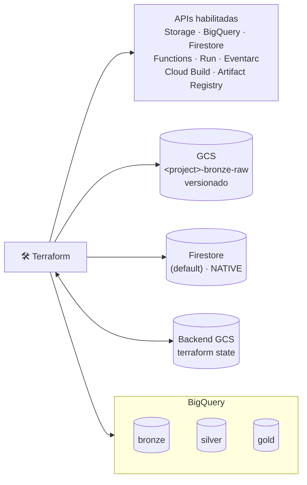

# Lab 01 · Fundamentos e Infraestructura como Código

[⬅️ Volver al README principal](../../../README.md) · [Siguiente: Lab 02 ➡️](../lab02-ingesta-api/README.md)

## 🎯 Objetivo

Construir la **base de la plataforma** con Terraform: habilitar las APIs de GCP, crear el data lake de la capa Bronze, los tres datasets de la arquitectura Medallion en BigQuery y la base de datos Firestore que servirá como fuente operacional.

## 🏗️ Arquitectura del laboratorio



## 📂 Archivos involucrados

| Archivo | Contenido |
|---|---|
| [`terraform/providers.tf`](../../../terraform/providers.tf) | Versión de Terraform, provider `google >= 5.0` y backend remoto en GCS |
| [`terraform/variables.tf`](../../../terraform/variables.tf) | `project_id`, `region`, `bq_location`, `github_repository` |
| [`terraform/main.tf`](../../../terraform/main.tf) | APIs, bucket Bronze, datasets y Firestore |
| [`terraform/outputs.tf`](../../../terraform/outputs.tf) | Nombre del bucket, Firestore y URLs de funciones |
| [`terraform/terraform.tfvars.example`](../../../terraform/terraform.tfvars.example) | Plantilla de variables (el `.tfvars` real está en `.gitignore`) |

## 🔍 Explicación de los recursos

### 1. Habilitación de APIs con `for_each`

```hcl
resource "google_project_service" "services" {
  for_each = toset([
    "storage.googleapis.com", "bigquery.googleapis.com", "firestore.googleapis.com",
    "cloudresourcemanager.googleapis.com", "cloudfunctions.googleapis.com",
    "run.googleapis.com", "artifactregistry.googleapis.com",
    "cloudbuild.googleapis.com", "eventarc.googleapis.com"
  ])
  service            = each.key
  disable_on_destroy = false
}
```

- Un solo bloque gestiona todas las APIs.
- `disable_on_destroy = false` evita deshabilitar APIs que otros recursos del proyecto podrían estar usando.
- Cloud Functions Gen2 depende de **Cloud Run, Cloud Build, Artifact Registry y Eventarc**, por eso se habilitan desde el inicio.

### 2. Bucket Bronze (data lake)

- Nombre único derivado del proyecto: `${var.project_id}-bronze-raw`.
- `uniform_bucket_level_access = true`: permisos solo por IAM (sin ACLs por objeto).
- `versioning` habilitado: si un archivo crudo se sobrescribe, la versión anterior se conserva → **trazabilidad y recuperación**.
- `force_destroy = true`: facilita limpiar el laboratorio (en producción se desactivaría).

### 3. Datasets Medallion

| Dataset | Rol |
|---|---|
| `bronze` | Datos crudos tal como llegan de la fuente |
| `silver` | Datos limpios, tipados, deduplicados y validados |
| `gold` | Modelos de negocio listos para BI |

Todos en la ubicación `var.bq_location` (`US` por defecto).

### 4. Firestore en modo nativo

La base `(default)` en `FIRESTORE_NATIVE` es la fuente operacional de clientes que se replicará por CDC en el Lab 03. GCP solo admite una base `(default)` por proyecto.

### 5. Backend remoto

```hcl
backend "gcs" {
  bucket = "curso-gcp-medallion-tfstate"
  prefix = "terraform/state"
}
```

El estado de Terraform vive en GCS (no en el repositorio), lo que permite que tanto la máquina local como GitHub Actions (Lab 11) trabajen sobre **el mismo estado**.

## ▶️ Cómo ejecutarlo

> ⚠️ El backend remoto ya está declarado en `providers.tf`, así que el bucket del estado **debe existir antes** de `terraform init`. Los nombres de bucket son globales en GCP: usa uno propio y actualízalo en el bloque `backend "gcs"`.
>
> ```bash
> gcloud storage buckets create gs://<TU_BUCKET_TFSTATE> --location=us-central1
> ```

```bash
cp terraform/terraform.tfvars.example terraform/terraform.tfvars   # editar valores
cd terraform
terraform init
terraform plan
terraform apply
```

## ✅ Validación

```bash
bq ls                                   # bronze, silver, gold
gcloud storage buckets list | grep bronze-raw
gcloud firestore databases list
terraform output
```

## 💡 Aprendizajes clave

- Declarar dependencias explícitas (`depends_on`) sobre las APIs evita errores de "API not enabled" en el primer `apply`.
- Separar la infraestructura por archivos `labN_*.tf` hace el proyecto modular y fácil de revisar.
- Nunca subir `*.tfstate` ni `*.tfvars` al repositorio: pueden contener información sensible.
