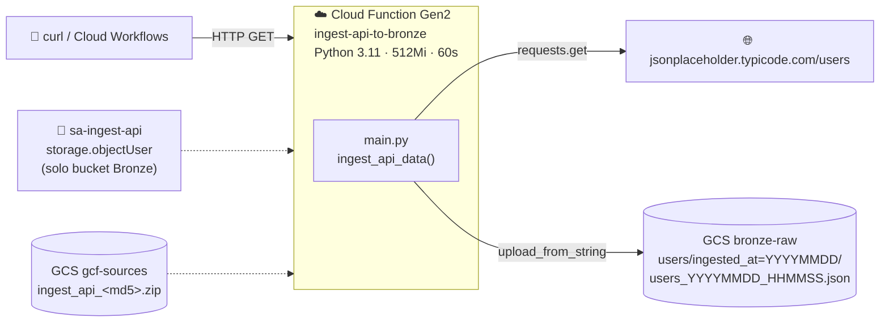

# Lab 02 · Ingesta desde API REST a la capa Bronze

[⬅️ Lab 01](../lab01-fundamentos-terraform/README.md) · [🏠 README principal](../../../README.md) · [Lab 03 ➡️](../lab03-cdc-firestore-bigquery/README.md)

## 🎯 Objetivo

Extraer datos de una **API REST externa** mediante una **Cloud Function Gen2 HTTP** y almacenarlos sin modificar en el data lake Bronze (Cloud Storage), con una estructura de carpetas particionada por fecha de ingesta.

## 🏗️ Arquitectura del laboratorio



## 📂 Archivos involucrados

| Archivo | Contenido |
|---|---|
| [`src/ingest_api/main.py`](../../../src/ingest_api/main.py) | Lógica de extracción y carga a GCS |
| [`src/ingest_api/requirements.txt`](../../../src/ingest_api/requirements.txt) | `functions-framework`, `requests`, `google-cloud-storage` |
| [`terraform/lab2_ingest_api.tf`](../../../terraform/lab2_ingest_api.tf) | Empaquetado, bucket de fuentes, SA, IAM y función |

## 🔍 Explicación del código

### Función Python

1. **Extrae** los datos con `requests.get(API_URL, timeout=10)` y valida el código HTTP con `raise_for_status()`.
2. **Genera una ruta particionada** estilo Hive:
   ```text
   users/ingested_at=20260612/users_20260612_153000.json
   ```
   Esto permite, en el futuro, crear tablas externas en BigQuery con particionamiento automático.
3. **Sube el JSON** al bucket cuyo nombre llega por variable de entorno `BUCKET_NAME` (inyectada por Terraform → sin valores hardcodeados).
4. **Manejo de errores diferenciado**: errores de red (`RequestException`) vs. errores inesperados, ambos devuelven `500` y quedan en Cloud Logging.

### Terraform

| Paso | Recurso | Por qué |
|---|---|---|
| 1 | `data.archive_file` | Comprime `src/ingest_api` en un ZIP |
| 2 | `google_storage_bucket.gcf_source_bucket` | Bucket dedicado a artefactos de despliegue |
| 3 | `google_storage_bucket_object` con `output_md5` en el nombre | Si el código no cambia, el nombre no cambia y **no hay redespliegue** |
| 4 | `google_service_account.cf_service_account` | Identidad propia de la función (mínimo privilegio) |
| 5 | `google_storage_bucket_iam_member` (`objectUser`) | Permiso **solo sobre el bucket Bronze**, no a nivel proyecto |
| 6 | `google_cloudfunctions2_function` | Runtime `python311`, `max_instance_count = 1` para controlar costos |
| 7 | `google_cloud_run_service_iam_member` (`allUsers`) | Invocación pública para pruebas del laboratorio |

## ▶️ Cómo ejecutarlo

```bash
cd terraform && terraform apply
URL=$(terraform output -raw cloud_function_url)
curl "$URL"
```

## ✅ Validación

```bash
gcloud storage ls -r gs://<PROJECT_ID>-bronze-raw/users/
gcloud functions logs read ingest-api-to-bronze --region=us-central1 --gen2
```

Respuesta esperada:

```text
Ingesta exitosa. Archivo guardado en: gs://<PROJECT_ID>-bronze-raw/users/ingested_at=YYYYMMDD/users_YYYYMMDD_HHMMSS.json
```

## 💡 Aprendizajes clave

- Cloud Functions Gen2 se ejecuta sobre **Cloud Run**, por eso el permiso de invocación es `roles/run.invoker`.
- Usar `datetime.now(timezone.utc)` en lugar del obsoleto `datetime.utcnow()`.
- El acceso `allUsers` permite probar la función con un simple `curl`. En el Lab 10 la función es invocada por Cloud Workflows, cuya SA también recibe `roles/run.invoker` sobre ella.
