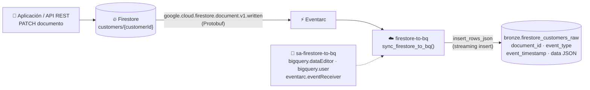
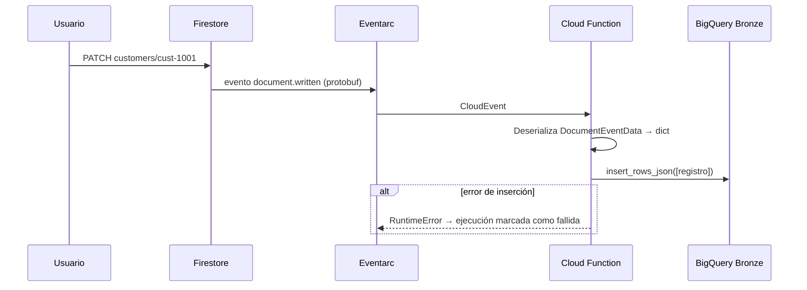

# Lab 03 · CDC en tiempo real: Firestore → BigQuery

[⬅️ Lab 02](../lab02-ingesta-api/README.md) · [🏠 README principal](../../../README.md) · [Lab 04 ➡️](../lab04-ingesta-batch/README.md)

## 🎯 Objetivo

Implementar **Change Data Capture (CDC)**: cada vez que se crea, modifica o elimina un documento en la colección `customers` de Firestore, el cambio se replica automáticamente en BigQuery (capa Bronze) en segundos, usando **Eventarc** y una **Cloud Function Gen2**.

## 🏗️ Arquitectura del laboratorio





## 📂 Archivos involucrados

| Archivo | Contenido |
|---|---|
| [`src/firestore_trigger/main.py`](../../../src/firestore_trigger/main.py) | Deserialización del evento y streaming insert |
| [`src/firestore_trigger/requirements.txt`](../../../src/firestore_trigger/requirements.txt) | `google-events`, `cloudevents`, `protobuf`, `google-cloud-bigquery` |
| [`terraform/lab3_firestore_to_bq.tf`](../../../terraform/lab3_firestore_to_bq.tf) | Tabla Bronze, SA, IAM, función y trigger |
| [`scripts/lab03_commands.sh`](../../../scripts/lab03_commands.sh) | Comandos para crear clientes de prueba |

## 🔍 Explicación del código

### Tabla Bronze (schema-on-read)

| Columna | Tipo | Descripción |
|---|---|---|
| `document_id` | STRING | ID del documento (ej. `cust-1001`) |
| `event_type` | STRING | Tipo de evento CloudEvent |
| `event_timestamp` | TIMESTAMP | Momento del cambio |
| `data` | **JSON** | Documento completo en crudo |

Guardar el documento como `JSON` hace que la ingesta **no se rompa** si la fuente agrega o cambia campos. La interpretación del esquema se hace después, en Silver.

### Función Python

1. Obtiene `subject` (`documents/customers/cust-1001`) y extrae el `document_id`.
2. Firestore envía los datos en **Protobuf binario**; se deserializan con `DocumentEventData()._pb.ParseFromString(...)`.
3. `MessageToDict` convierte el documento a un diccionario con la estructura tipada de Firestore:
   ```json
   {"fields": {"name": {"stringValue": "Juan Perez"}, "active": {"booleanValue": true}}}
   ```
4. Inserta el registro vía **streaming insert** (`insert_rows_json`).
5. Si falla, **propaga la excepción**: la ejecución queda registrada como fallida en Cloud Logging en lugar de perderse en silencio. Para que Eventarc reintente automáticamente habría que activar `retry_policy = "RETRY_POLICY_RETRY"` en el `event_trigger`.

### Trigger de Eventarc

```hcl
event_trigger {
  event_type = "google.cloud.firestore.document.v1.written"   # create + update + delete
  event_filters { attribute = "database"  value = "(default)" }
  event_filters {
    attribute = "document"
    value     = "customers/{customerId}"
    operator  = "match-path-pattern"
  }
}
```

## ▶️ Cómo ejecutarlo

```bash
curl -X PATCH \
  "https://firestore.googleapis.com/v1/projects/<PROJECT_ID>/databases/(default)/documents/customers/cust-1001" \
  -H "Authorization: Bearer $(gcloud auth print-access-token)" \
  -H "Content-Type: application/json" \
  -d '{"fields":{"name":{"stringValue":"Juan Perez"},"email":{"stringValue":"juan.perez@example.com"},"active":{"booleanValue":true},"signup_date":{"timestampValue":"2026-06-12T12:00:00Z"}}}'
```

## ✅ Validación

```sql
SELECT document_id, event_type, event_timestamp,
       JSON_VALUE(data.fields.email.stringValue) AS email
FROM `bronze.firestore_customers_raw`
ORDER BY event_timestamp DESC;
```

Cada modificación del mismo cliente genera **una nueva fila**: Bronze es un log de eventos *append-only*, lo que preserva el historial completo.

## 💡 Aprendizajes clave

- Los eventos de Firestore llegan en Protobuf, no en JSON: se necesita la librería `google-events`.
- Bronze como log inmutable permite reconstruir cualquier estado pasado.
- La deduplicación y el "último estado" se resuelven en Silver (Lab 06), no en la ingesta.
