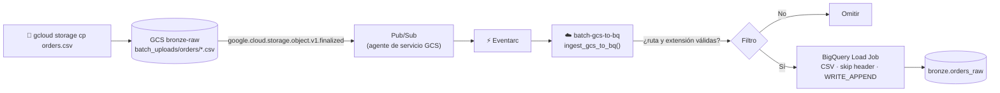

# Lab 04 · Ingesta batch reactiva: Cloud Storage → BigQuery

[⬅️ Lab 03](../lab03-cdc-firestore-bigquery/README.md) · [🏠 README principal](../../../README.md) · [Lab 05 ➡️](../lab05-bronze-a-silver/README.md)

## 🎯 Objetivo

Automatizar la carga de **archivos CSV de órdenes de compra**: en cuanto un archivo llega a una ruta específica del bucket Bronze, una Cloud Function lanza un **BigQuery Load Job** que lo importa a la tabla `bronze.orders_raw`.

## 🏗️ Arquitectura del laboratorio



## 📂 Archivos involucrados

| Archivo | Contenido |
|---|---|
| [`src/ingest_batch/main.py`](../../../src/ingest_batch/main.py) | Filtrado del evento y lanzamiento del Load Job |
| [`terraform/lab4_batch_ingestion.tf`](../../../terraform/lab4_batch_ingestion.tf) | Tabla, permisos de GCS → Pub/Sub, SA, función y trigger |
| [`orders.csv`](../../../orders.csv) | Datos de ejemplo |

## 🔍 Explicación del código

### Esquema estricto en Bronze

| Columna | Tipo | Nota |
|---|---|---|
| `id` | STRING | ID de la orden |
| `customer_id` | STRING | Referencia al cliente de Firestore |
| `product_id` | STRING | |
| `amount` | FLOAT | |
| `order_date` | **STRING** | Se mantiene como texto; se parsea en Silver |

El esquema se define en Terraform y la función usa `autodetect=False` → un CSV con columnas incorrectas **falla de forma explícita** en vez de crear datos inconsistentes.

### Función Python

1. Lee `bucket` y `name` del evento de Storage.
2. **Filtra**: solo procesa archivos bajo `batch_uploads/orders/` con extensión `.csv`. Como el trigger escucha todo el bucket (incluidos los JSON del Lab 02), este filtro es esencial.
3. Configura un `LoadJobConfig` (`CSV`, `skip_leading_rows=1`, `WRITE_APPEND`).
4. Lanza `load_table_from_uri` y espera el resultado con `load_job.result()`.

> **¿Por qué un Load Job y no pandas?** BigQuery carga el archivo directamente desde GCS. La función no descarga ni parsea nada: es más rápido, escalable a archivos grandes y las cargas batch en BigQuery **no tienen costo de ingesta**.

### Permiso clave de Eventarc para Storage

```hcl
data "google_storage_project_service_account" "gcs_account" {}

resource "google_project_iam_member" "gcs_pubsub_publishing" {
  role   = "roles/pubsub.publisher"
  member = "serviceAccount:${data.google_storage_project_service_account.gcs_account.email_address}"
}
```

Sin este rol, el agente de servicio de Cloud Storage no puede publicar eventos y **el trigger nunca se dispara**.

## ▶️ Cómo ejecutarlo

```bash
gcloud storage cp orders.csv gs://<PROJECT_ID>-bronze-raw/batch_uploads/orders/orders_20260612.csv
```

## ✅ Validación

```sql
SELECT * FROM `bronze.orders_raw` ORDER BY id;
```

```bash
gcloud functions logs read batch-gcs-to-bq --region=us-central1 --gen2
```

## 💡 Aprendizajes clave

- El evento `object.finalized` se dispara al completar la escritura de un objeto (creación o sobrescritura).
- Subir el mismo archivo dos veces genera duplicados en Bronze (por `WRITE_APPEND`); esto se resuelve en Silver con deduplicación (Lab 06).
- `timeout_seconds = 120` da margen para archivos más pesados.
