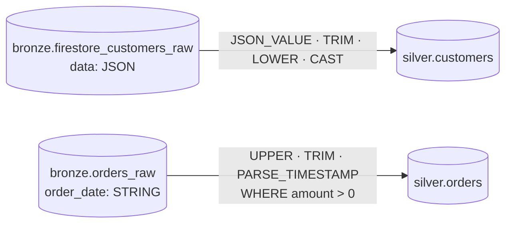

# Lab 05 · Transformación Bronze → Silver

[⬅️ Lab 04](../lab04-ingesta-batch/README.md) · [🏠 README principal](../../../README.md) · [Lab 06 ➡️](../lab06-scd1-deduplicacion/README.md)

## 🎯 Objetivo

Crear la **capa Silver**: convertir los datos crudos de Bronze en tablas **tipadas, normalizadas y consultables**, aplicando las primeras reglas de limpieza.

## 🏗️ Arquitectura del laboratorio



## 📂 Archivos involucrados

| Archivo | Contenido |
|---|---|
| [`sql/silver_customers.sql`](../../../sql/silver_customers.sql) | Carga completa de clientes |
| [`sql/silver_orders.sql`](../../../sql/silver_orders.sql) | Carga completa de órdenes |
| [`scripts/lab05_commands.sh`](../../../scripts/lab05_commands.sh) | Comandos de ejecución y verificación |

## 🔍 Transformaciones aplicadas

### Clientes (`silver.customers`)

| Campo destino | Transformación | Propósito |
|---|---|---|
| `customer_id` | `document_id` | Clave de negocio |
| `name` | `TRIM(JSON_VALUE(data.fields.name.stringValue))` | Extraer del JSON y quitar espacios |
| `email` | `LOWER(TRIM(...))` | Normalizar para comparaciones |
| `is_active` | `CAST(... AS BOOL)` | Tipado |
| `signup_date` | `TIMESTAMP(...)` | Tipado |
| `ingestion_timestamp` | `event_timestamp` | Linaje temporal |

> `JSON_VALUE(data.fields.name.stringValue)` navega la estructura tipada que produce Firestore (`fields → campo → tipoValue`).

### Órdenes (`silver.orders`)

| Campo destino | Transformación |
|---|---|
| `order_id` | `UPPER(TRIM(id))` |
| `customer_id` | `TRIM(customer_id)` |
| `product_id` | `UPPER(TRIM(product_id))` |
| `amount` | `CAST(amount AS FLOAT64)` |
| `order_date` | `PARSE_TIMESTAMP('%Y-%m-%d %H:%M:%S', TRIM(order_date))` |
| — | `WHERE amount > 0` (descarta montos inválidos) |

## ▶️ Cómo ejecutarlo

```bash
bq query --use_legacy_sql=false < sql/silver_customers.sql
bq query --use_legacy_sql=false < sql/silver_orders.sql
```

## ✅ Validación

```bash
bq show --format=prettyjson silver.customers
bq query --use_legacy_sql=false \
  'SELECT order_id, customer_id, amount, order_date FROM `silver.orders` LIMIT 5'
```

## ⚠️ Limitación de este enfoque

`CREATE OR REPLACE TABLE` reconstruye la tabla completa en cada ejecución y, en clientes, conserva **todas las versiones** de cada documento (una fila por evento CDC). Ambos problemas se resuelven en el **Lab 06** con `MERGE` incremental y deduplicación.

## 💡 Aprendizajes clave

- Bronze conserva la fuente intacta; Silver es donde se decide el tipado y la semántica.
- Normalizar (`TRIM`, `LOWER`, `UPPER`) evita duplicados "invisibles" por diferencias de formato.
