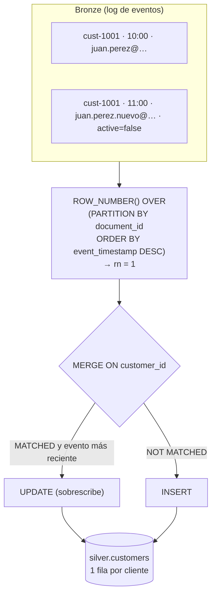

# Lab 06 · Carga incremental con SCD Tipo 1 y deduplicación

[⬅️ Lab 05](../lab05-bronze-a-silver/README.md) · [🏠 README principal](../../../README.md) · [Lab 07 ➡️](../lab07-calidad-cuarentena/README.md)

## 🎯 Objetivo

Reemplazar la carga completa del Lab 05 por un **procesamiento incremental e idempotente** con `MERGE`:

- **Clientes → SCD Tipo 1**: se conserva solo el estado más reciente de cada cliente.
- **Órdenes → deduplicación**: aunque un archivo se cargue dos veces, cada orden aparece una sola vez.

## 🏗️ Arquitectura del laboratorio



## 📂 Archivos involucrados

| Archivo | Contenido |
|---|---|
| [`sql/silver_customers_merge.sql`](../../../sql/silver_customers_merge.sql) | MERGE SCD1 de clientes |
| [`sql/silver_orders_merge.sql`](../../../sql/silver_orders_merge.sql) | MERGE con deduplicación de órdenes |
| [`scripts/lab06_commands.sh`](../../../scripts/lab06_commands.sh) | Escenario de prueba de actualización |

## 🔍 Explicación

### ¿Qué es SCD Tipo 1?

Una *Slowly Changing Dimension* Tipo 1 **sobrescribe** los atributos cuando cambian, sin guardar historial en la tabla. Aquí es seguro hacerlo porque el historial completo **ya está preservado en Bronze**.

### MERGE de clientes

```sql
WHEN MATCHED AND S.ingestion_timestamp > T.ingestion_timestamp THEN UPDATE ...
WHEN NOT MATCHED THEN INSERT ...
```

- La condición `S.ingestion_timestamp > T.ingestion_timestamp` evita que un evento **antiguo** sobrescriba uno más nuevo (protección ante eventos fuera de orden).
- Incluye filtros de calidad (nombre, email, fecha) que se amplían en el Lab 07.

### MERGE de órdenes

- `ROW_NUMBER() OVER (PARTITION BY id ORDER BY order_date DESC)` elimina duplicados dentro de Bronze.
- Solo `WHEN NOT MATCHED THEN INSERT`: una orden es un hecho **inmutable**, no se actualiza.
- Solo entran órdenes cuyo `customer_id` existe en `silver.customers`.

### Idempotencia

Ejecutar el MERGE N veces produce el mismo resultado que ejecutarlo una vez. Es la propiedad que permite reintentar el pipeline de forma segura.

## ▶️ Escenario de prueba

```bash
# 1. Estado inicial
bq query --use_legacy_sql=false \
  'SELECT customer_id, name, email, is_active FROM `silver.customers` WHERE customer_id = "cust-1001"'

# 2. Modificar el cliente en Firestore (email nuevo y active=false)
curl -X PATCH ".../documents/customers/cust-1001" ... \
  -d '{"fields":{"name":{"stringValue":"Juan Perez"},"email":{"stringValue":"juan.perez.nuevo@example.com"},"active":{"booleanValue":false},"signup_date":{"timestampValue":"2026-06-12T12:00:00Z"}}}'

# 3. Bronze ahora tiene 2 eventos para cust-1001
bq query --use_legacy_sql=false \
  'SELECT document_id, event_timestamp, JSON_VALUE(data.fields.email.stringValue) AS email
   FROM `bronze.firestore_customers_raw` WHERE document_id = "cust-1001"'

# 4. Aplicar el MERGE
bq query --use_legacy_sql=false < sql/silver_customers_merge.sql

# 5. Silver muestra una sola fila con el email nuevo
```

## ✅ Resultado esperado

| customer_id | email | is_active |
|---|---|---|
| cust-1001 | juan.perez.nuevo@example.com | false |

## 💡 Aprendizajes clave

- `MERGE` combina INSERT y UPDATE en una sola operación atómica.
- Separar "log inmutable" (Bronze) de "estado actual" (Silver) permite SCD1 sin perder auditoría.
