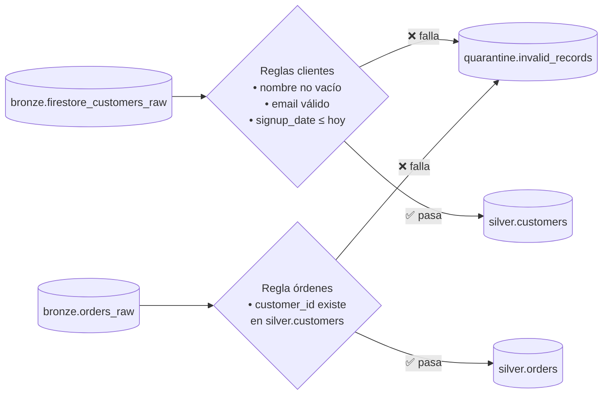

# Lab 07 · Calidad de datos y patrón de cuarentena

[⬅️ Lab 06](../lab06-scd1-deduplicacion/README.md) · [🏠 README principal](../../../README.md) · [Lab 08 ➡️](../lab08-seguridad-gobernanza/README.md)

## 🎯 Objetivo

Impedir que datos corruptos lleguen a Silver y, en lugar de descartarlos en silencio, **desviarlos a una tabla de cuarentena** con el motivo del rechazo y el payload original, para que puedan auditarse y corregirse.

## 🏗️ Arquitectura del laboratorio



## 📂 Archivos involucrados

| Archivo | Contenido |
|---|---|
| [`terraform/lab7_data_quality.tf`](../../../terraform/lab7_data_quality.tf) | Dataset `quarantine` y tabla `invalid_records` |
| [`sql/quality_customers_audit.sql`](../../../sql/quality_customers_audit.sql) | Auditoría de clientes |
| [`sql/quality_orders_audit.sql`](../../../sql/quality_orders_audit.sql) | Auditoría de integridad referencial de órdenes |
| [`orders_erroneas.csv`](../../../orders_erroneas.csv) | Orden huérfana de prueba (`cust-9999`) |
| [`scripts/lab07_commands.sh`](../../../scripts/lab07_commands.sh) | Escenario completo de prueba |

## 🔍 Explicación

### Tabla unificada de cuarentena

| Columna | Descripción |
|---|---|
| `table_name` | Entidad de origen (`customers`, `orders`) |
| `record_key` | Clave del registro rechazado |
| `error_reason` | Regla violada, legible para negocio |
| `rejected_payload` | Registro original serializado (`TO_JSON_STRING`) |
| `rejected_at` | Momento de la detección |

Una **sola tabla para todas las entidades** simplifica el monitoreo (Lab 12).

### Reglas de calidad

| Entidad | Regla | Mensaje |
|---|---|---|
| Cliente | Nombre nulo o vacío | "El nombre está vacío o es nulo" |
| Cliente | Email sin formato `%@%.%` | "Formato de correo electrónico inválido" |
| Cliente | Fecha de registro futura | "Fecha de registro inconsistente (en el futuro)" |
| Orden | `customer_id` no existe | "Violación de Integridad Referencial…" |

El `CASE` asigna el **primer motivo** que aplique a cada registro.

### Separación de responsabilidades

- **Auditoría** (`quality_*_audit.sql`): detecta y registra los inválidos.
- **MERGE** de Silver (Lab 06): aplica los mismos filtros para dejar pasar solo los válidos.

### Idempotencia y orden de ejecución

- Cada auditoría incluye un `NOT EXISTS` sobre la propia tabla de cuarentena: si el mismo rechazo ya está registrado, no se vuelve a insertar. Así, re-ejecutar el pipeline no duplica errores.
- Las órdenes se auditan **después** de cargar los clientes en Silver. De lo contrario, una orden de un cliente que llega en la misma ejecución se marcaría por error como huérfana.

## ▶️ Escenario de prueba

```bash
# 1. Cliente con email corrupto
curl -X PATCH ".../documents/customers/cust-1003" ... \
  -d '{"fields":{"name":{"stringValue":"Usuario Corrupto"},"email":{"stringValue":"correo_sin_formato"},...}}'

# 2. Orden de un cliente inexistente
gcloud storage cp orders_erroneas.csv gs://<PROJECT_ID>-bronze-raw/batch_uploads/orders/orders_erroneas.csv

# 3. Clientes: auditoría → cuarentena y MERGE → Silver
bq query --use_legacy_sql=false < sql/quality_customers_audit.sql
bq query --use_legacy_sql=false < sql/silver_customers_merge.sql

# 4. Órdenes: auditoría → cuarentena y MERGE → Silver
bq query --use_legacy_sql=false < sql/quality_orders_audit.sql
bq query --use_legacy_sql=false < sql/silver_orders_merge.sql
```

## ✅ Validación

```sql
SELECT table_name, record_key, error_reason
FROM `quarantine.invalid_records`;
```

| table_name | record_key | error_reason |
|---|---|---|
| customers | cust-1003 | Formato de correo electrónico inválido |
| orders | ord-999 | Violación de Integridad Referencial… |
| orders | ord-104 | Violación de Integridad Referencial… |

Y `cust-1003` **no aparece** en `silver.customers`.

## 💡 Aprendizajes clave

- Nunca descartar datos en silencio: la cuarentena da trazabilidad y permite reprocesar.
- La integridad referencial en un data warehouse (sin *foreign keys* forzadas) debe validarse en el pipeline.