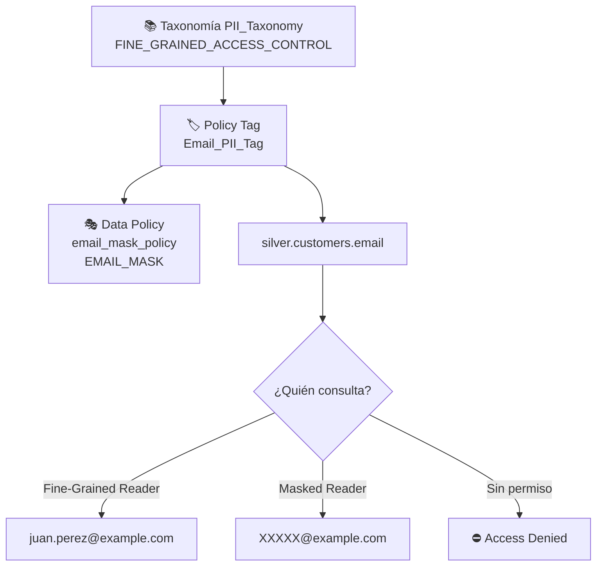

# Lab 08 · Seguridad y gobernanza de datos (PII)

[⬅️ Lab 07](../lab07-calidad-cuarentena/README.md) · [🏠 README principal](../../../README.md) · [Lab 09 ➡️](../lab09-modelado-dimensional/README.md)

## 🎯 Objetivo

Proteger datos personales (**PII**) con **seguridad a nivel de columna** en BigQuery: clasificar la columna `email` mediante un **Policy Tag** de Data Catalog y aplicar **enmascaramiento dinámico** para que los usuarios sin privilegios vean el valor ofuscado.

## 🏗️ Arquitectura del laboratorio



## 📂 Archivos involucrados

| Archivo | Contenido |
|---|---|
| [`terraform/lab8_security_governance.tf.example`](../../../terraform/lab8_security_governance.tf.example) | APIs, taxonomía, policy tag, data policy y tabla `silver.customers` con la etiqueta |

> ℹ️ El archivo tiene extensión `.example`, por lo que **Terraform no lo aplica** en el despliegue automático. Se conserva como implementación de referencia. Para activarlo, renómbralo a `.tf`, asegúrate de que la **región de la taxonomía coincida con la ubicación del dataset** (`US` multi-región vs. `us-central1`) y que `silver.customers` no exista previamente creada por SQL (o impórtala con `terraform import`).

## 🔍 Explicación de los recursos

| # | Recurso | Función |
|---|---|---|
| 1 | `google_project_service` | Habilita `datacatalog` y `bigquerydatapolicy` |
| 2 | `google_data_catalog_taxonomy` | Agrupa las clasificaciones de datos sensibles y activa el control de acceso fino |
| 3 | `google_data_catalog_policy_tag` | Etiqueta `Email_PII_Tag` que se asigna a columnas |
| 4 | `google_bigquery_datapolicy_data_policy` | Regla de enmascaramiento `EMAIL_MASK` asociada al tag |
| 5 | `google_bigquery_table.silver_customers` | Tabla Silver gestionada por Terraform con `policyTags` en la columna `email` |

### ¿Cómo funciona?

1. La columna `email` queda asociada al Policy Tag.
2. BigQuery evalúa, en cada consulta, los roles IAM del usuario sobre el tag:
   - `roles/datacatalog.categoryFineGrainedReader` → ve el valor real.
   - `roles/bigquerydatapolicy.maskedReader` → ve el valor enmascarado.
   - Sin rol → la consulta de esa columna falla.
3. **No se duplican datos ni se crean vistas**: una sola tabla sirve a todos los perfiles.

## ▶️ Cómo aplicarlo

```bash
mv terraform/lab8_security_governance.tf.example terraform/lab8_security_governance.tf
cd terraform && terraform plan && terraform apply

# Conceder vista enmascarada a un analista
gcloud data-catalog taxonomies policy-tags add-iam-policy-binding ...  # o desde la consola
```

## ✅ Validación

Consultar como un usuario con rol *Masked Reader*:

```sql
SELECT customer_id, email FROM `silver.customers`;
```

## 💡 Aprendizajes clave

- La gobernanza se declara como código, igual que la infraestructura.
- Los Policy Tags son regionales: la taxonomía debe estar en la misma ubicación que los datasets.
- El enmascaramiento dinámico permite cumplir normativas de privacidad (GDPR, Habeas Data) sin fragmentar el modelo.
