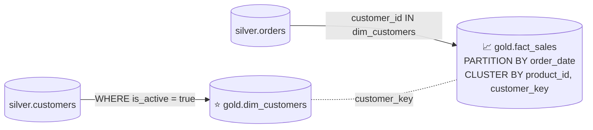
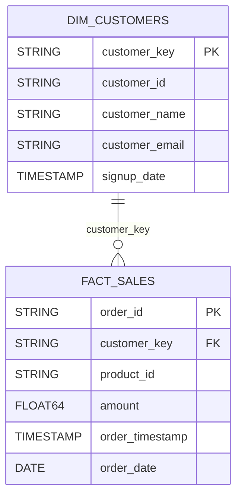

# Lab 09 · Modelado dimensional en Gold: particionamiento y clustering

[⬅️ Lab 08](../lab08-seguridad-gobernanza/README.md) · [🏠 README principal](../../../README.md) · [Lab 10 ➡️](../lab10-orquestacion-workflows/README.md)

## 🎯 Objetivo

Construir la **capa Gold** con un **esquema en estrella** optimizado para analítica: una dimensión de clientes activos y una tabla de hechos de ventas **particionada por fecha y clusterizada** para minimizar costo y latencia de consulta.

## 🏗️ Arquitectura del laboratorio





## 📂 Archivos involucrados

| Archivo | Contenido |
|---|---|
| [`sql/gold_dim_customers.sql`](../../../sql/gold_dim_customers.sql) | Dimensión de clientes activos |
| [`sql/gold_fact_sales.sql`](../../../sql/gold_fact_sales.sql) | Tabla de hechos particionada y clusterizada |
| [`scripts/lab09_commands.sh`](../../../scripts/lab09_commands.sh) | Ejecución y consulta de validación |

## 🔍 Explicación

### Dimensión `gold.dim_customers`

- Solo clientes con `is_active = true` (regla de negocio).
- Columnas renombradas con semántica de negocio (`customer_name`, `customer_email`).
- `customer_key` como clave de relación con los hechos.

### Hechos `gold.fact_sales`

```sql
CREATE OR REPLACE TABLE `gold.fact_sales`
PARTITION BY order_date
CLUSTER BY product_id, customer_key
```

| Técnica | Qué hace | Beneficio |
|---|---|---|
| **Particionamiento** por `order_date` (DATE) | Divide la tabla físicamente por día | Una consulta filtrada por fecha solo lee las particiones necesarias (*partition pruning*) |
| **Clustering** por `product_id`, `customer_key` | Ordena los datos dentro de cada partición | Filtros y joins por producto/cliente escanean menos bloques |

- Se conservan `order_timestamp` (precisión original) y `order_date` (para particionar).
- **Consistencia referencial**: solo entran ventas de clientes presentes en la dimensión, evitando hechos huérfanos en los reportes.

## ▶️ Cómo ejecutarlo

```bash
bq query --use_legacy_sql=false < sql/gold_dim_customers.sql
bq query --use_legacy_sql=false < sql/gold_fact_sales.sql
```

## ✅ Validación

```bash
bq show --format=prettyjson gold.fact_sales   # ver timePartitioning y clustering
```

```sql
SELECT f.order_id, c.customer_name, f.product_id, f.amount, f.order_date
FROM `gold.fact_sales` f
JOIN `gold.dim_customers` c ON f.customer_key = c.customer_key
LIMIT 10;
```

## 💡 Aprendizajes clave

- En BigQuery el costo se basa en bytes escaneados: particionar y clusterizar impacta directamente la factura.
- Filtrar siempre por la columna de partición en las consultas de BI.
- El esquema en estrella simplifica los modelos en herramientas como Looker Studio.
