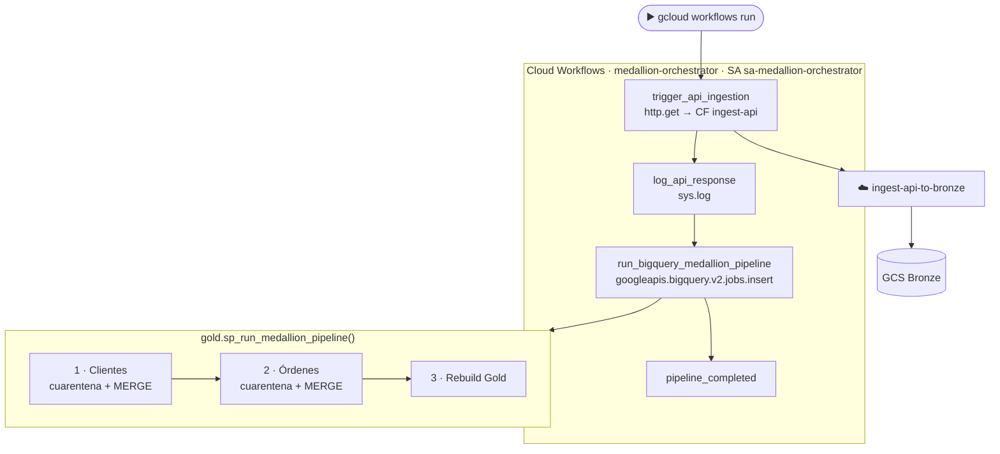

# Lab 10 · Orquestación con Cloud Workflows y Stored Procedure

[⬅️ Lab 09](../lab09-modelado-dimensional/README.md) · [🏠 README principal](../../../README.md) · [Lab 11 ➡️](../lab11-cicd-github-actions/README.md)

## 🎯 Objetivo

Unificar todos los pasos del pipeline en **una sola ejecución automatizada**:

1. Encapsular calidad + Silver + Gold en un **Stored Procedure** de BigQuery.
2. Orquestar la ingesta API y el procedimiento con **Cloud Workflows**, desplegado por Terraform.

## 🏗️ Arquitectura del laboratorio



## 📂 Archivos involucrados

| Archivo | Contenido |
|---|---|
| [`sql/gold_sp_run_medallion_pipeline.sql`](../../../sql/gold_sp_run_medallion_pipeline.sql) | Stored Procedure con las 3 fases |
| [`workflows/medallion_workflow.yaml`](../../../workflows/medallion_workflow.yaml) | Definición del workflow |
| [`terraform/lab10_orchestration.tf`](../../../terraform/lab10_orchestration.tf) | API, SA, IAM y despliegue del workflow |
| [`scripts/lab10_commands.sh`](../../../scripts/lab10_commands.sh) | Despliegue del SP y ejecución |

## 🔍 Explicación

### Stored Procedure: tres fases

| Fase | Sentencias | Resultado |
|---|---|---|
| 1 · Clientes | `INSERT INTO quarantine.invalid_records` + `MERGE silver.customers` (SCD1) | Clientes inválidos en cuarentena, válidos en Silver |
| 2 · Órdenes | `INSERT INTO quarantine.invalid_records` + `MERGE silver.orders` (dedup) | Órdenes huérfanas en cuarentena, válidas en Silver |
| 3 · Gold | `CREATE OR REPLACE` de `dim_customers` y `fact_sales` | Modelo estrella refrescado |

**¿Por qué este orden?** Las órdenes se validan contra `silver.customers` después de cargar los clientes de la misma ejecución. Así, una orden de un cliente recién creado no se marca por error como huérfana.

**Idempotencia de la cuarentena:** cada `INSERT` usa `NOT EXISTS` para no volver a registrar un rechazo que ya existe, así que ejecutar el pipeline varias veces no infla los conteos de `vw_platform_health`.

Ventaja: la lógica SQL se versiona en Git y se ejecuta **dentro de BigQuery**, con una única llamada: ``CALL `gold.sp_run_medallion_pipeline`();``

### Workflow YAML

- `http.get` invoca la Cloud Function por su URL. La SA del workflow tiene `run.invoker` sobre la función; para enviar un token de identidad en la llamada se añadiría `auth: {type: OIDC}` en `args`.
- El conector nativo `googleapis.bigquery.v2.jobs.insert` **espera a que el job termine** antes de continuar; si falla, el workflow falla.
- `$${...}` en el YAML escapa las expresiones de Workflows para que `templatefile()` de Terraform no las interprete.

### Terraform + `templatefile`

```hcl
source_contents = templatefile("${path.module}/../workflows/medallion_workflow.yaml", {
  project_id = var.project_id
  api_cf_url = google_cloudfunctions2_function.ingest_api_function.service_config[0].uri
})
```

La URL de la función se inyecta dinámicamente: si la función cambia, el workflow se actualiza solo.

### Permisos de `sa-medallion-orchestrator`

| Rol | Motivo |
|---|---|
| `bigquery.jobUser` | Crear jobs de consulta |
| `bigquery.dataEditor` | Escribir en Silver, Gold y Quarantine |
| `logging.logWriter` | Requerido por `sys.log` |
| `run.invoker` (solo en la CF de API) | Invocar la función de ingesta |

## ▶️ Cómo ejecutarlo

```bash
bq query --use_legacy_sql=false < sql/gold_sp_run_medallion_pipeline.sql
cd terraform && terraform apply && cd ..
gcloud workflows run medallion-orchestrator --location=us-central1
```

## ✅ Validación

```bash
gcloud workflows executions list medallion-orchestrator --location=us-central1
```

Resultado esperado: `"Pipeline Medallion orquestado y ejecutado exitosamente de extremo a extremo."`

## 💡 Aprendizajes clave

- Workflows es ideal para orquestación ligera y serverless (pago por paso ejecutado), frente a Cloud Composer.
- Centralizar el pipeline en un SP facilita pruebas y despliegue (Lab 11).