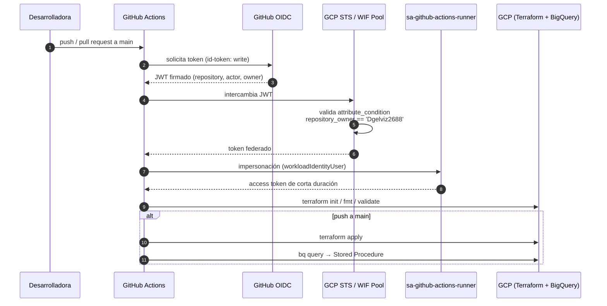

# Lab 11 · CI/CD con GitHub Actions y Workload Identity Federation

[⬅️ Lab 10](../lab10-orquestacion-workflows/README.md) · [🏠 README principal](../../../README.md) · [Lab 12 ➡️](../lab12-looker-studio/README.md)

## 🎯 Objetivo

Automatizar la validación y el despliegue de la plataforma con **GitHub Actions**, autenticándose en GCP **sin llaves de cuenta de servicio** mediante **Workload Identity Federation (OIDC)**, y con el estado de Terraform en un **backend remoto** compartido.

## 🏗️ Arquitectura del laboratorio



## 📂 Archivos involucrados

| Archivo | Contenido |
|---|---|
| [`.github/workflows/deploy.yml`](../../../.github/workflows/deploy.yml) | Pipeline CI/CD |
| [`terraform/lab11_wif.tf`](../../../terraform/lab11_wif.tf) | Pool, provider OIDC, SA del runner y binding de impersonación |
| [`terraform/providers.tf`](../../../terraform/providers.tf) | Backend remoto en GCS |
| [`scripts/lab11_commands.sh`](../../../scripts/lab11_commands.sh) | Creación del bucket de estado y migración |

## 🔍 Explicación

### 1. Estado remoto

```bash
gcloud storage buckets create gs://curso-gcp-medallion-tfstate --location=us-central1
terraform init -migrate-state
```

El estado local se migra a GCS para que el runner de GitHub y la máquina local compartan la misma fuente de verdad.

### 2. Workload Identity Federation

| Recurso | Propósito |
|---|---|
| `google_iam_workload_identity_pool` `github-pool` | Contenedor de identidades externas |
| `google_iam_workload_identity_pool_provider` `github-provider` | Confía en `https://token.actions.githubusercontent.com` y mapea claims (`sub`, `actor`, `repository`, `repository_owner`) |
| `attribute_condition` | Solo tokens de repositorios de `Dgelviz2688` son aceptados |
| `google_service_account_iam_member` (`workloadIdentityUser`) | Solo el repositorio `var.github_repository` puede impersonar a la SA |

**Ventaja frente a llaves JSON:** no hay secretos de larga duración que rotar o que puedan filtrarse; los tokens expiran en minutos.

### 3. Pipeline `deploy.yml`

| Paso | Cuándo |
|---|---|
| Checkout | Siempre |
| `google-github-actions/auth@v2` (WIF) | Siempre |
| `setup-gcloud` + `setup-terraform` (1.7.0) | Siempre |
| `terraform init` · `fmt -check` · `validate` | PR y push |
| `terraform apply -auto-approve` | Solo push a `main` |
| Despliegue del Stored Procedure con `bq query` | Solo push a `main` |

`permissions: id-token: write` es imprescindible para que GitHub emita el token OIDC.

### 4. Configuración de secrets

```bash
cd terraform
terraform output gcp_wif_provider   # → secret GCP_WIF_PROVIDER
terraform output gcp_sa_email       # → secret GCP_SA_EMAIL
```

En GitHub: *Settings → Secrets and variables → Actions → New repository secret*.

## ✅ Validación

- Abrir un PR: el job ejecuta solo validaciones.
- Hacer merge a `main`: se ejecutan `apply` y el despliegue del SP.
- Revisar la pestaña **Actions** del repositorio.

## 🧩 Problemas resueltos durante el laboratorio

| Problema | Solución |
|---|---|
| El pipeline quedaba esperando input de `github_repository` | Se añadió un valor `default` a la variable |
| `terraform fmt -check` fallaba | Se formatearon los `.tf` con `terraform fmt` |
| El YAML del pipeline no se ejecutaba | Se movió de `workflows/` a `.github/workflows/` |

## 💡 Aprendizajes clave

- WIF es la práctica recomendada por Google para CI/CD externo.
- `fmt -check` como *quality gate* mantiene un estilo consistente.