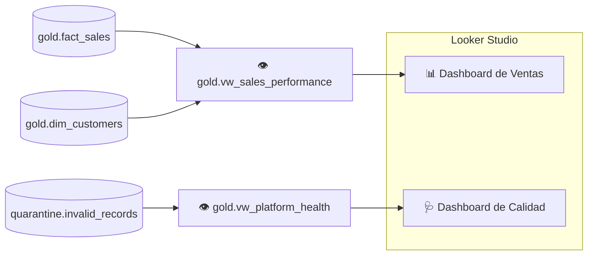

# Lab 12 · Visualización con Looker Studio

[⬅️ Lab 11](../lab11-cicd-github-actions/README.md) · [🏠 README principal](../../../README.md)

## 🎯 Objetivo

Exponer la capa Gold a usuarios de negocio mediante **vistas semánticas** en BigQuery y construir dashboards en **Looker Studio** (antes Data Studio) para dos audiencias:

- 📈 **Negocio:** desempeño de ventas.
- 🩺 **Equipo de datos:** salud y calidad de la plataforma.

## 🏗️ Arquitectura del laboratorio



## 📂 Archivos involucrados

| Archivo | Contenido |
|---|---|
| [`sql/gold_vw_sales_performance.sql`](../../../sql/gold_vw_sales_performance.sql) | Vista de ventas (hechos + dimensión) |
| [`sql/gold_vw_platform_health.sql`](../../../sql/gold_vw_platform_health.sql) | Vista de errores de calidad agregados |
| [`scripts/lab12_commands.sh`](../../../scripts/lab12_commands.sh) | Creación de las vistas |

## 🔍 Explicación

### `gold.vw_sales_performance`

Une `fact_sales` con `dim_customers` y expone columnas listas para BI:

| Columna | Uso en el dashboard |
|---|---|
| `order_id` | Conteo de órdenes |
| `product_id` | Dimensión de producto |
| `amount` | Métrica de ingresos |
| `order_date` | Serie temporal y filtro de fecha (aprovecha la partición) |
| `customer_name`, `customer_email` | Detalle por cliente |

### `gold.vw_platform_health`

```sql
SELECT table_name, error_reason,
       COUNT(*) AS error_count,
       MAX(rejected_at) AS last_error_detected
FROM `quarantine.invalid_records`
GROUP BY table_name, error_reason;
```

Convierte la cuarentena en un **indicador de observabilidad**: cuántos errores hay por tipo y cuándo se detectó el último.

### ¿Por qué vistas y no tablas?

- **Capa semántica**: el dashboard no depende del modelo físico; si cambia, solo se ajusta la vista.
- **Siempre actualizadas**: reflejan la última ejecución del pipeline sin procesos extra.
- **Control de acceso**: se puede compartir la vista sin exponer todas las tablas subyacentes.

## ▶️ Cómo ejecutarlo

```bash
bq query --use_legacy_sql=false < sql/gold_vw_sales_performance.sql
bq query --use_legacy_sql=false < sql/gold_vw_platform_health.sql
```

### Conectar Looker Studio

1. Ir a [lookerstudio.google.com](https://lookerstudio.google.com) → **Crear → Fuente de datos → BigQuery**.
2. Seleccionar el proyecto → dataset `gold` → vista `vw_sales_performance`.
3. Repetir con `vw_platform_health`.
4. Crear el informe.

### Visualizaciones sugeridas

| Dashboard | Gráfico | Configuración |
|---|---|---|
| Ventas | Tarjetas KPI | `SUM(amount)`, `COUNT_DISTINCT(order_id)`, ticket promedio |
| Ventas | Serie temporal | `order_date` vs. `SUM(amount)` |
| Ventas | Barras | Ventas por `product_id` |
| Ventas | Tabla | Top clientes por `amount` |
| Calidad | Barras | `error_count` por `error_reason` |
| Calidad | Tabla | `table_name`, `error_reason`, `last_error_detected` |

> 📸 *Agrega aquí capturas de tus dashboards (por ejemplo en `docs/img/`) para enriquecer el portafolio.*

## 💡 Aprendizajes clave

- La capa Gold existe para ser consumida: las vistas son el contrato con el negocio.
- Monitorear la calidad de datos con la misma herramienta de BI acerca la observabilidad al equipo.
- Recuerda que la vista de ventas contiene PII (`customer_email`): con el Lab 08 activo se enmascara según el rol del usuario.
